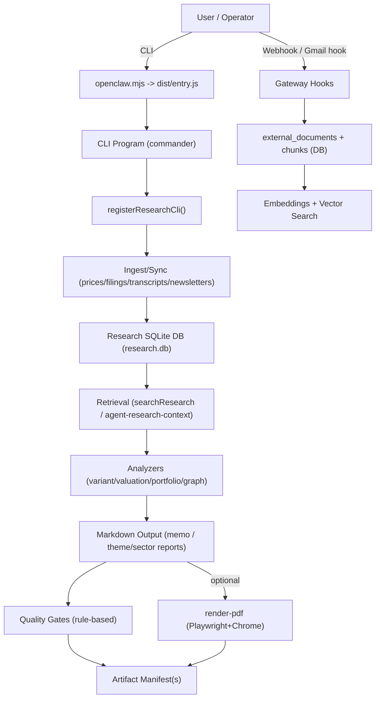
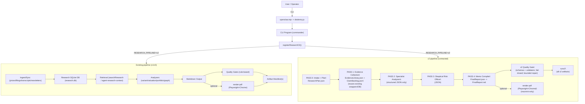

# Current Stack Map (As-Is)

This document maps the current institutional research system end-to-end: entrypoints, tool wrappers, memory/retrieval, synthesis/output, rendering, and scoring.

## High-Level Flow

## v2 Overlay Flow (Feature-Flagged)

v2 runs alongside the existing pipeline and is gated behind `RESEARCH_PIPELINE=v2` in `src/cli/research-cli.ts`.

## Entrypoints

### CLI
- `openclaw.mjs`
  - Loads the compiled CLI entrypoint: `dist/entry.js`.
- CLI registration
  - `src/cli/program/register.subclis.ts`
    - Registers the `research` sub-CLI by dynamically importing:
      - `src/cli/research-cli.ts` -> `registerResearchCli(program)`

### Gateway Hooks (Research Email Ingest)
- `src/gateway/server/hooks.ts`
  - Builds a research candidate from inbound Gmail hook messages.
  - If the message matches the RESEARCH heuristic, it calls:
    - `src/research/external-research.ts` -> `ingestExternalResearchDocument(...)`
  - This is the primary path for ingesting “RESEARCH emails/newsletters” into the local DB without touching the research CLI.

### Agent Runtime (Context Injection)
- `src/research/agent-research-context.ts`
  - `buildAgentResearchContext({ prompt, dbPath, limit })`
  - Used by the Pi embedded agent runner to inject evidence snippets into LLM conversations.
  - Referenced from:
    - `src/agents/pi-embedded-runner/run/attempt.ts` (context building and injection)

## Research CLI Surface (Current)

All commands live in `src/cli/research-cli.ts`. The most relevant ones for “memos/reports” are:
- `openclaw research memo`
  - Core single-name memo generator.
  - Implementation: `src/research/memo.ts` -> `generateMemoAsync(...)`
- `openclaw research theme-research`
  - Cross-sectional thematic report generator.
  - Implementation: `src/research/theme-sector.ts` + `src/research/theme-sector-report.ts`
- `openclaw research sector-research`
  - Cross-sectional sector report generator.
  - Implementation: `src/research/theme-sector.ts` + `src/research/theme-sector-report.ts`

Supporting/required plumbing commands:
- `openclaw research prices|filings|fundamentals|expectations|transcript`
  - Populate `research.db` with primary/secondary sources.
  - Implemented in `src/research/ingest.ts` + `src/research/transcript-scraper.ts` + `src/research/sec-filings.ts` + `src/research/alpha-vantage.ts`
- `openclaw research ingest-external` + `openclaw research newsletter-sync`
  - Ingest external research text (emails/newsletters/manual).
  - Implemented in `src/research/external-research.ts`
- `openclaw research embed` + `openclaw research search`
  - Vector search over the research corpus (and optionally code corpus).
  - Implemented in `src/research/vector-search.ts` + `src/research/embeddings-provider.ts`
- `openclaw research render-pdf`
  - Markdown -> styled HTML -> PDF using Playwright + Chrome.
  - Implemented in `src/cli/research-cli.ts` (command code path)
- Artifact lifecycle helpers
  - `openclaw research preflight` (manifest-first bundle)
  - `openclaw research manifest-file` (manifest an existing artifact)
  - `openclaw research artifact-path` (next versioned path)
  - `openclaw research pdf-diagnostics` (detect common PDF failures)
  - Implemented in:
    - `src/research/artifact-preflight.ts`
    - `src/research/artifact-manifest.ts`
    - `src/cli/research-cli.ts`

## Tool Wrappers / Data Providers (Current)

### SEC / Filings / Fundamentals
- SEC XBRL “companyfacts” time series:
  - `src/agents/sec-xbrl-timeseries.ts`
  - Exposed via: `openclaw research sec-xbrl`
- SEC filings ingest:
  - `src/research/sec-filings.ts`
  - Called via `src/research/ingest.ts` and `openclaw research filings`

### Market Data
- Price ingestion:
  - `src/research/ingest.ts` -> `ingestPrices(...)`
  - Uses `src/research/alpha-vantage.ts` (MASSIVE_API_KEY / POLYGON_API_KEY)

### Transcripts
- `src/research/transcript-scraper.ts`
- `src/research/ingest.ts` -> `ingestTranscript(...)`

### Newsletters / External Research
- Ingest and chunk:
  - `src/research/external-research.ts`
- Hook path:
  - `src/gateway/server/hooks.ts`
- CLI path:
  - `openclaw research ingest-external`
  - `openclaw research newsletter-sync`

## Memory / Retrieval Layer

### Storage
- `src/research/db.ts`
  - `resolveResearchDbPath()` (defaults to state directory) and `openResearchDb()`
  - Primary DB: `data/research.db` in this repo (for local dev), or state dir DB in production

### Chunking
- `src/research/chunker.ts`
  - Normalizes long sources into `chunks` rows.

### Embeddings + Vector Search
- `src/research/embeddings-provider.ts`
  - Providers:
    - `openai` embeddings (requires `OPENAI_API_KEY`)
    - fallback `hash` embeddings (offline, lower quality)
- `src/research/vector-search.ts`
  - `syncEmbeddings(dbPath)`
  - `searchResearch({ query, ticker, source })`

### Agent “Research Context” Retrieval
- `src/research/agent-research-context.ts`
  - Fetches evidence snippets from `chunks` joined against `filings/transcripts/fundamental_facts/...`
  - Output is injected into LLM prompts as a `<research-context>` block.

## Synthesis / Output

### Company Memo (Markdown)
- `src/research/memo.ts`
  - Builds:
    - Exhibits (tables + takeaways)
    - Variant view, valuation scenarios, portfolio posture, falsifiers, monitoring
    - Appendix with “Source List (timestamped)”
  - Uses:
    - `src/research/variant.ts`
    - `src/research/valuation.ts`
    - `src/research/portfolio.ts`
    - `src/research/research-cell.ts` (rule-based skeptical debate)
    - `src/research/knowledge-graph.ts` (graph snapshot)

### Theme/Sector Reports (Markdown)
- `src/research/theme-sector.ts` (compute)
- `src/research/theme-sector-report.ts` (render markdown)

## Quality Gates / Scoring

### Institutional Output Gate (rule-based)
- `src/research/institutional-output-gate.ts`
  - `enforceInstitutionalOutputGateV3(...)`
  - Ensures sections exist, exhibit minimums, “Takeaway:” lines, actionability, and freshness constraints.
  - Performs bounded “repair passes” (rule-based inserts), not LLM-based rewriting.
- Rubric source:
  - `research-corpus/rubrics/institutional_memo_rubric_v3.json`
  - Prompts/samples (currently not wired into generation):
    - `research-corpus/prompts/*.txt`
    - `research-corpus/samples/*.md`

### Quality Gate Runs (DB-backed telemetry)
- `src/research/quality-gate.ts`
  - Persists structured quality gate evaluations in `quality_gate_runs`.

### Artifact Manifests (file + series)
- `src/research/artifact-manifest.ts`
  - `writeArtifactManifest(...)` for markdown outputs
  - `writeFileArtifactManifest(...)` for file outputs (e.g., PDF)

## Rendering

### Markdown -> PDF
- `src/cli/research-cli.ts` -> `research render-pdf`
  - Markdown rendered to HTML (`markdown-it`), printed via Playwright + Chrome.
  - Writes a PDF artifact manifest and blocks unchanged artifacts / unicode dashes / missing sources.
  - Guardrail: restricted to macmini only (browser execution).

## Where To Insert a v2 Pipeline (Safely)

The lowest-risk insertion points are the CLI command handlers (not the lower-level analyzers):

1. `src/cli/research-cli.ts`
   - Add a new command group (recommended): `openclaw research v2 ...`
   - Or route existing commands behind a feature flag:
     - `RESEARCH_PIPELINE=v2` (or similar)
     - If unset, current behavior remains unchanged.

2. Reuse current analyzers as “PASS 2” structured outputs (no prose):
   - `variant.ts`, `valuation.ts`, `portfolio.ts`, `knowledge-graph.ts`, `theme-sector.ts`
   - These are stable, deterministic, and already tested.

3. Add v2 “contract layer” + “evidence library” as wrappers around existing outputs:
   - Validate and fail-closed *before* rendering/delivery.
   - Keep the existing v3 gate intact; v2 can run alongside it.
